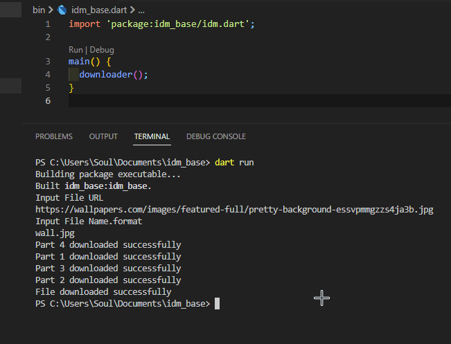

## IDM in your Commandline
A sample command-line application with an entrypoint to download large file in remarkable speed like IDM internet download manager does.

## Screenshot

## Features

- Download Large File in High Speed
- It can split requested file and send multiple GET request
- Save in a Custom Directory

## Getting Started

1. Clone this repository
2. Open the project in your preferred IDE (e.g. Android Studio, Visual Studio Code)
3. Install the necessary dependencies by running `dart pub get`
4. Run the app on an emulator or physical device by running `dart run`

## Dependencies

- [http](https://pub.dev/packages/http) for network request and downloading files

## 🔗 Follow

